# Digital Book Library — Web Client

The **React + Vite + TypeScript** front-end for the Digital Book Library. It is two apps in one
shell: a **public visitor site** ("Knowledge Oasis") for browsing and reading, and an **admin
dashboard** for managing the catalogue and users. Fully **bilingual — Arabic (RTL) / English (LTR)** —
with light/dark themes, talking to the [ASP.NET Core API](https://github.com/HadiAljaami/DigitalBookLibrary).


## Screenshots

## 🌐 Public Website — الموقع العام

### Home Page — الصفحة الرئيسية
| Light Mode | Dark Mode (English) |
|:---:|:---:|
| 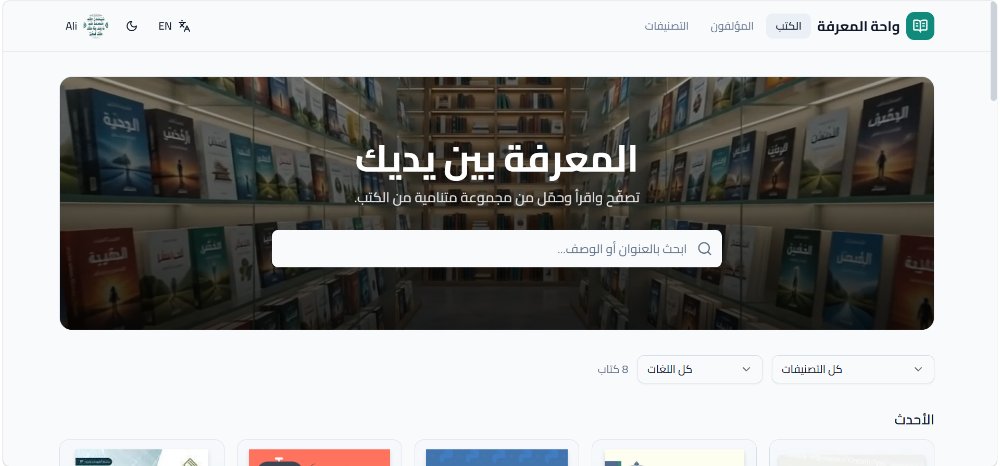 | 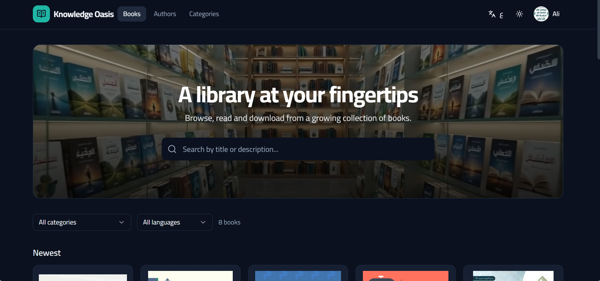 |

### Books & Authors — الكتب والمؤلفون
| Section | Light Mode | Dark Mode |
|:---:|:---:|:---:|
| **Books** | 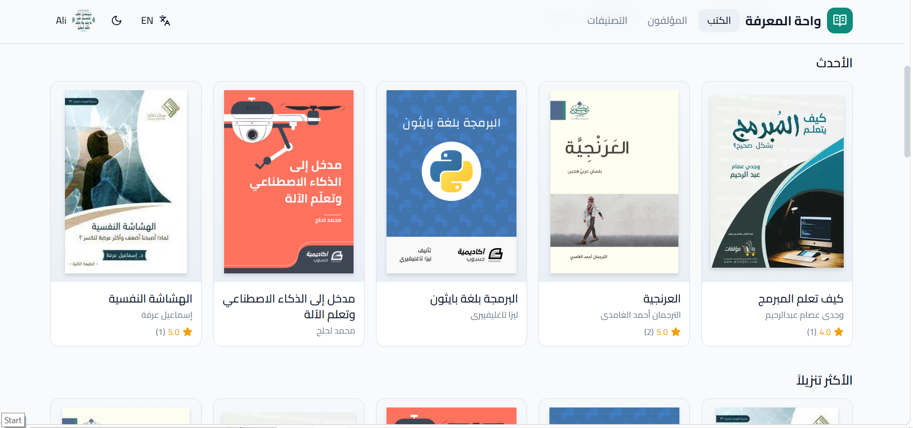 | 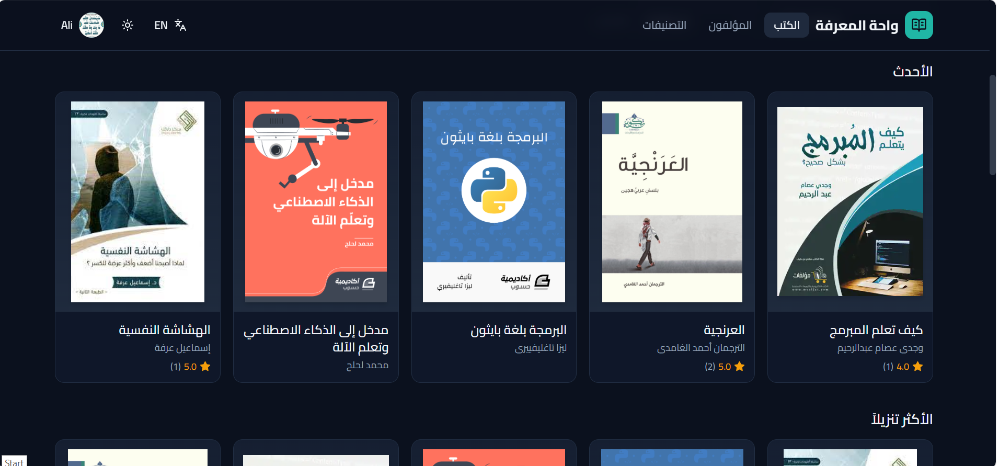 |
| **Authors** | 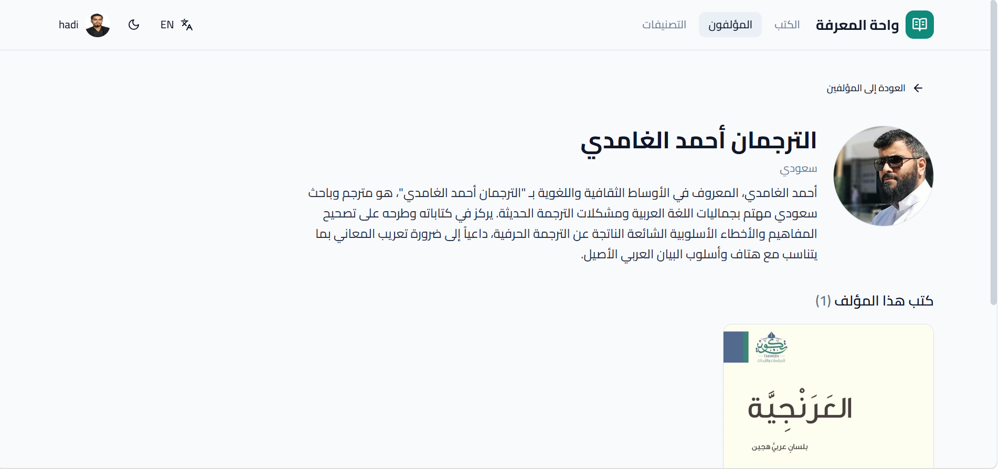 | 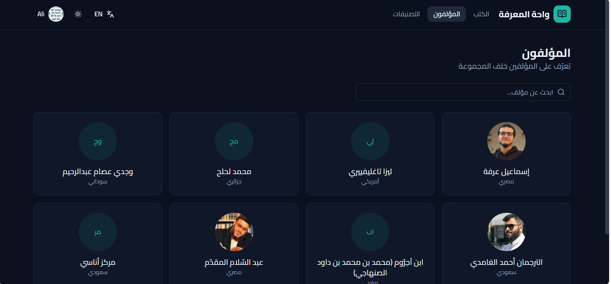 |

### Categories & My Books — التصنيفات وكتبي 
| Categories | My Books |
|:---:|:---:|
| 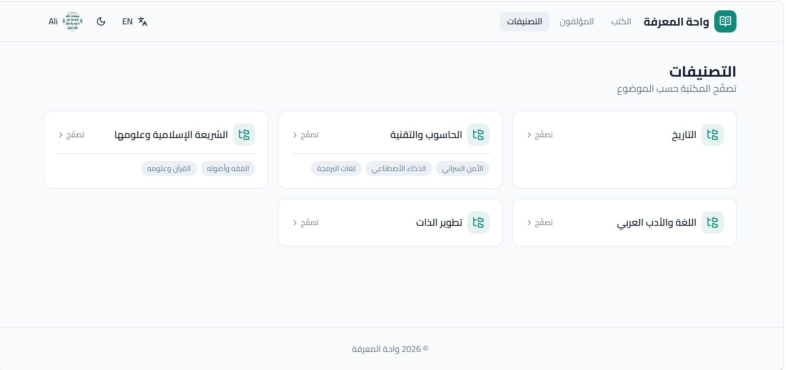 | 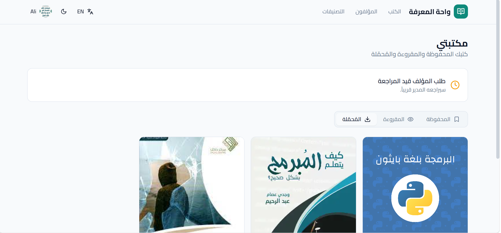 |

### Book Details, Description & Comments — تفاصيل الكتاب والتعليقات
| Book Details | Description & Comments |
|:---:|:---:|
| 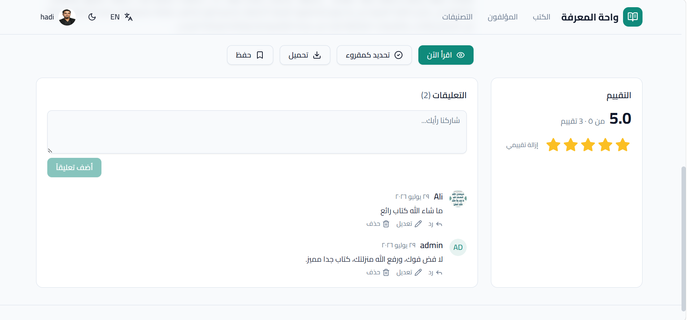 | 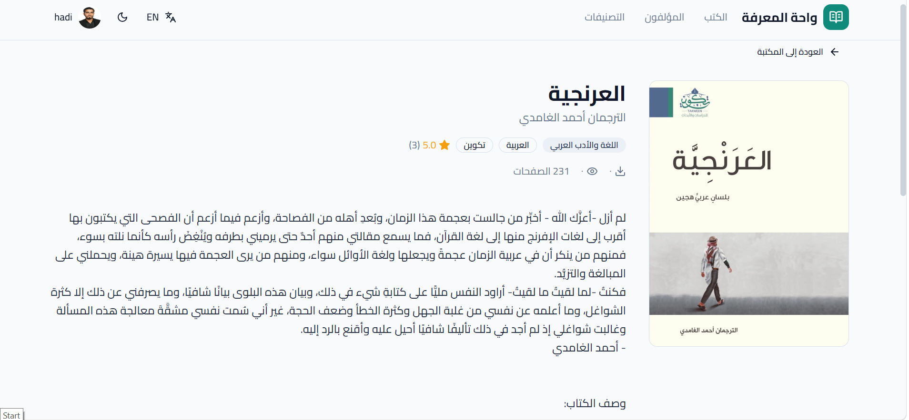 |

---

## 🛠️ Admin Dashboard — لوحة التحكم

### Overview & Main Dashboard — النظرة العامة
| Light Mode | Dark Mode |
|:---:|:---:|
| 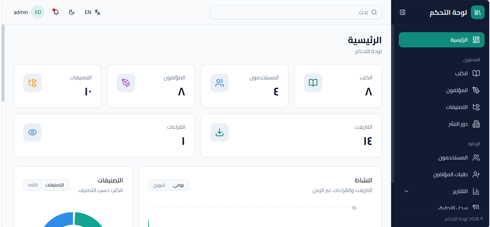 | 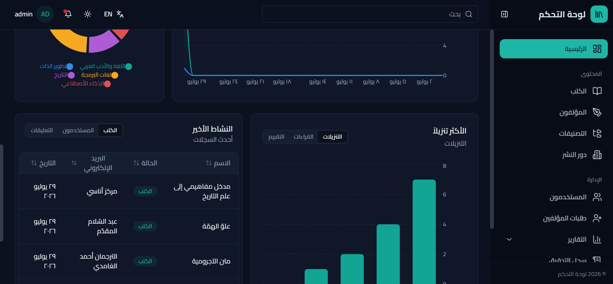 |

### Management — إدارة المحتوى
| Section | Screenshot |
|:---:|:---:|
| **Categories Dashboard** | 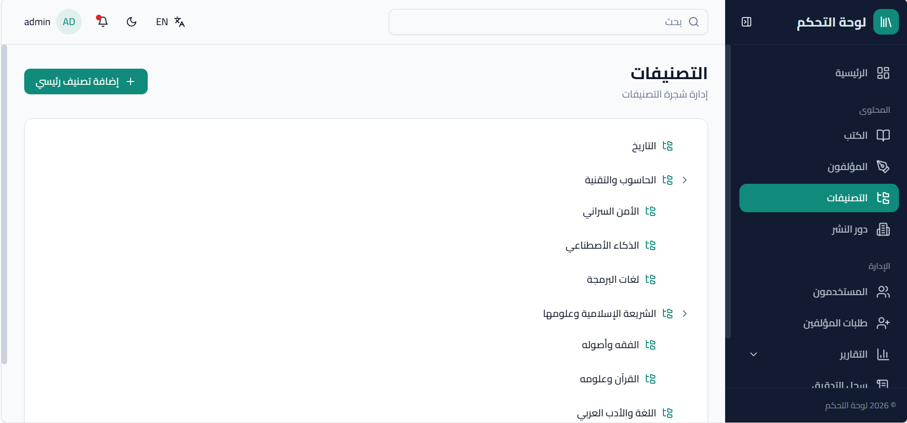 |
| **Book Dashboard** |  |
| **Authors Dashboard** | 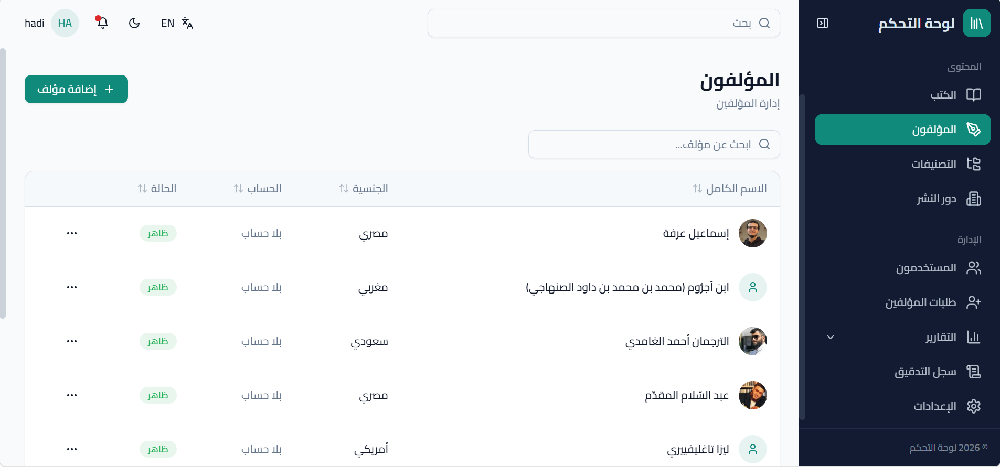 |
| **Author Requests Dashboard** | 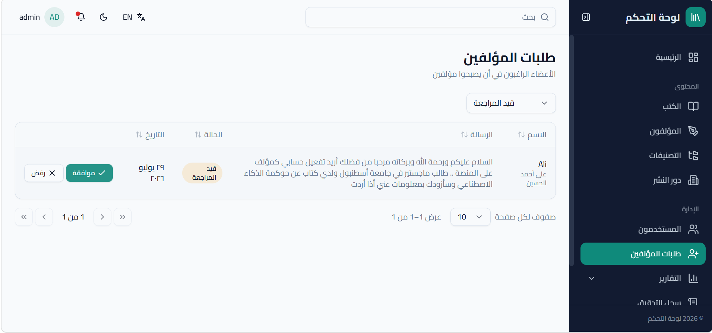 |
| **Publishers Dashboard** | 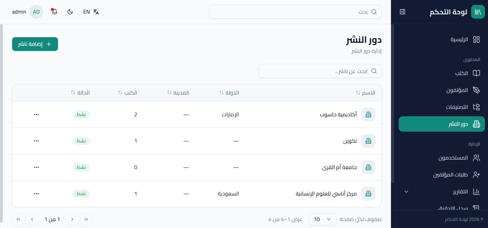 |

### Reports & Audit Logs — التقارير وسجلات النظام
| Report Type | Screenshot |
|:---:|:---:|
| **Audit Logs (Dark)** | 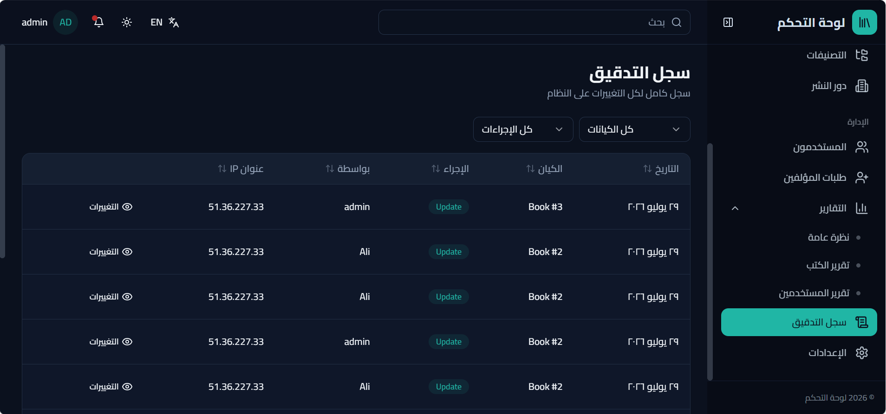 |
| **Audit Logs (English / Dark)** | 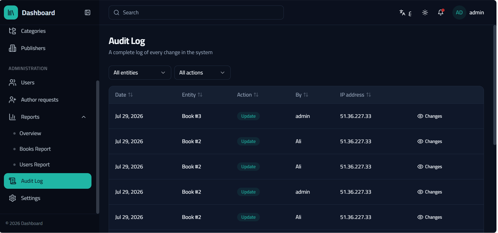 |
| **Overview Report (English / Dark)** | 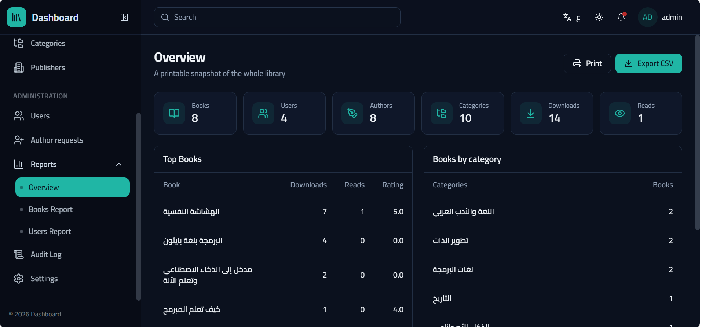 |
| **Book Reports** | 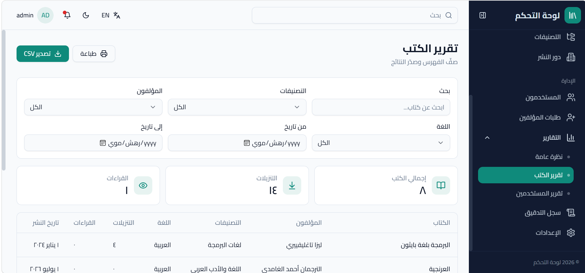 |
| **User Reports** | 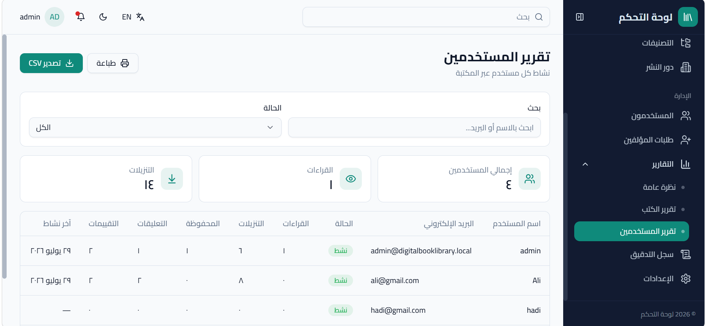 |
<!-- | Public library | Book details |
|:---:|:---:|
|  |  |

| Admin dashboard | Author — my books |
|:---:|:---:|
|  |  | -->

## Features

**Public site**
- Browse the catalogue with search, category-tree and language filters, "most read / downloaded / newest" showcases, and load-more paging.
- Book page with cover, rating summary, and threaded comments (paged, collapsible replies).
- Read online or download the PDF; save favourites; mark books as read; personal library (saved / read / downloaded).
- Members can request to become an author; authors publish and manage their own books (including show/hide and availability) and edit their own profile and password.

**Admin dashboard**
- KPI cards, charts (Recharts) and recent-activity feed.
- Manage books, authors, categories, publishers and users; approve author requests; filterable reports; audit log.
- Server-side data tables (sort, search, pagination), cascading lookups, image uploads, role management.

**Cross-cutting**
- Bilingual Arabic/English with a live toggle that flips `dir`, layout and charts (i18next, logical CSS properties).
- Light/dark theming via CSS variables.
- JWT auth with a single-flight refresh; route guards for authenticated and admin-only areas.

## Stack

React 18 · Vite 5 · TypeScript · Tailwind CSS · Radix UI (shadcn-style) · TanStack Query & Table ·
React Hook Form + Zod · Recharts · react-i18next · React Router · Axios.

## Getting started

```bash
npm install
npm run dev      # http://localhost:3000
```

The dev server proxies `/api` to the backend on `http://localhost:5014` (see `vite.config.ts`). To
point at a different API, copy `.env.example` to `.env` and set `VITE_API_BASE_URL`.

```bash
npm run build    # type-check + production build
npm run preview  # preview the build
```

## Structure

```
src/
  pages/            admin dashboard pages
    public/         public visitor site (home, book, authors, library, my-books, account)
  features/         feature dialogs & cards (books, authors, users, account, ...)
  components/
    ui/             primitives (button, dialog, select, table, avatar, ...)
    public/         public layout, book cards, ratings, comments
    dashboard/      stat cards, chart cards, data table, page header
  services/         typed API clients (one per module)
  hooks/            server-side table, cached lookups, localisation
  providers/        auth + theme context
  lib/              axios client (envelope unwrap, refresh, uploads), helpers
  i18n/             i18next setup + ar/en locale files
  types/            shared DTO/response types
```

## Related

The backend API (ASP.NET Core, Clean Architecture) lives at
**[HadiAljaami/DigitalBookLibrary](https://github.com/HadiAljaami/DigitalBookLibrary)**.
